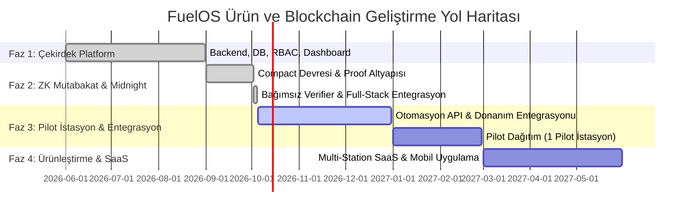

# FUELOS | Midnight Zero-Knowledge Mutabakat Platformu
## Akaryakıt İstasyonları İçin Gizlilik Odaklı Doğrulama ve Akıllı Vardiya Mutabakatı
### White Paper V2.0 & Kapsamlı Teknik Rapor
**Tarih:** 4 Ekim 2026  
**Sürüm:** V2.0 (Teknik Gerçekleme ve Entegrasyon Sürümü)  
**Yazarlar:** FuelOS & Midnight Core Engineering Team  
**İlgili Modüller:** `midnight/`, `backend/`, `frontend/`

---

## 1. Yönetici Özeti (Executive Summary)

Akaryakıt istasyonları; yüksek nakit sirkülasyonu, çoklu banka POS cihazları, mobil ödeme/FAST sistemleri ve 7/24 vardiyalı saha operasyonları nedeniyle Türkiye ve küresel perakende sektörünün en karmaşık finansal mutabakat halkalarından birini oluşturmaktadır. Geleneksel istasyon otomasyonları (Asis, Turpak, Mepsan vb.) yalnızca pompa akışını kaydeder; buna karşılık gün sonu ve vardiya kapanışlarında kasa mutabakatı hâlen manuel tutanaklar, Excel tabloları ve insan inisiyatifine bırakılmış kontrollerle yürütülmektedir.

**FuelOS**, mevcut pompa ve yazarkasa donanımlarına dokunmadan, bu sistemlerin üzerinde çalışan akıllı bir dijital operasyon ve mutabakat katmanı olarak tasarlanmıştır.

Platformun çekirdek teknolojik farklılaştırıcısı olan **Akıllı Vardiya Mutabakatı (Smart Shift Reconciliation)**, işletmelerin vardiya kapanışlarındaki finansal tutarlılığını garanti altına alırken ticari mahremiyeti korumak üzere **Midnight Zero-Knowledge (ZK)** blockchain altyapısı üzerine inşa edilmiştir.

Bu White Paper (V2.0); 2 Ekim 2026 tarihli PoC devir raporundaki eksikliklerin (private girdisiz bağımsız doğrulama, deterministik vardiya & tolerans taahhüdü, ağ/cüzdan dağıtım iskelesi ve uçtan uca full-stack entegrasyonu) nasıl eksiksiz tamamlandığını, Compact devre matematiğini, güvenlik analizlerini ve pilot dağıtım mimarisini belgelemektedir.

> **Temel İlke:**  
> *"İşletmenin operasyonunu yönet, kritik mutabakatı sıfır bilgi ile doğrula, ticari sırları asla zincire veya üçüncü taraflara ifşa etme."*

---

## 2. Vizyon ve Değer Önerisi (Privacy + Verifiability)

FuelOS'un vizyonu, akaryakıt istasyonlarına sadece bir muhasebe paneli sunmak değil; verinin güvenilirliğini, değişmezliğini ve gerektiğinde bağımsız denetçilere ispatlanabilirliğini sağlayan kurumsal bir güven katmanı oluşturmaktır.

```
┌────────────────────────────────────────────────────────┐
│                      GELENEKSEL YAKLAŞIM               │
│                                                        │
│   Tüm Ciro, POS, Nakit Verisi Paylaşılır ──► GİZLİLİK RİSKİ │
│                           VEYA                         │
│   Hiçbir Veri Paylaşılmaz ───────────────► GÜVEN EKSİKLİĞİ │
└────────────────────────────────────────────────────────┘
                           ▼
┌────────────────────────────────────────────────────────┐
│                   FUELOS + MIDNIGHT ÇÖZÜMÜ             │
│                                                        │
│   Özel Veriler (Ciro, Nakit, POS) Saklı Kalır          │
│   ZK Kanıtı (2940 Bayt) Paylaşılır                     │
│   Sonuç: %100 MATEMATİKSEL İSPAT + %100 GİZLİLİK       │
└────────────────────────────────────────────────────────┘
```

### Değer Önermeleri:
1. **Sıfır Bilgi İfşası (Zero Information Leakage):** İstasyonun net cirosu, hangi bankadan ne kadar POS tahsilatı yaptığı veya kasada kaç TL nakit bulunduğu gibi ticari sırlar asla dışarı sızmaz.
2. **Kriptografik İspat (Cryptographic Proof):** Vardiya tahsilatları ile pompa satışlarının tanımlı yetkili tolerans aralığında örtüştüğü matematiksel SNARK kanıtı ile mühürlenir.
3. **Bağımsız Denetim (Independent Trustless Audit):** Şirket merkezleri, akaryakıt dağıtım şirketleri (Ana Dağıtıcılar) veya finansal denetçiler, özel verilere erişmeden kanıtı saniyeler içinde doğrulayabilir.
4. **Manipülasyon İmkânsızlığı:** Kasiyer veya yöneticilerin geriye dönük tutanak değiştirmesi, sisteme sahte tolerans enjekte etmesi veya başka vardiyanın kanıtını kopyalaması (Replay Attack) kriptografik taahhüt (commitment) mimarisiyle engellenmiştir.

---

## 3. Sistem Mimarisi ve Katman Dağılımı

FuelOS mimarisi dört ana katmandan meydana gelir:

```
┌────────────────────────────────────────────────────────────────────────┐
│                        1. SAHA VE İSTASYON KATMANI                     │
│   Ön Saha Pompaları  │  Sanal POS / Banka Terminalleri  │  Nakit Kasa  │
└───────────────────────────────────┬────────────────────────────────────┘
                                    │
                                    ▼
┌────────────────────────────────────────────────────────────────────────┐
│                        2. FUELOS OPERASYON KATMANI                     │
│  FastAPI Backend  │  React 19 Dashboard  │  PostgreSQL & AsyncPG       │
│  - Vardiya Yönetimi & Pompa Atamaları                                  │
│  - Dinamik Kasa Mutabakatı (DEC-001 / K-001)                           │
│  - Deterministic Shift Commitment Üretimi                              │
└───────────────────────────────────┬────────────────────────────────────┘
                                    │
                                    ▼
┌────────────────────────────────────────────────────────────────────────┐
│                        3. ZERO-KNOWLEDGE KANIT KATMANI                 │
│  Compact Circuit Runtime  │  Midnight Proof Server (Port 6300)         │
│  - Integer Kuruş Hassasiyetinde Toplama ve Karşılaştırma               │
│  - ZK-SNARK Kanıt Üretimi (2940 Bayt zk-proof)                         │
│  - Bağımsız Verifier Modülü (Private Input Gerekmez)                   │
└───────────────────────────────────┬────────────────────────────────────┘
                                    │
                                    ▼
┌────────────────────────────────────────────────────────────────────────┐
│                        4. MIDNIGHT BLOCKCHAIN KATMANI                  │
│  Midnight Network (Testnet/Mainnet)  │  Indexers & Node RPC            │
│  - Değişmez Kanıt ve Durum Kaydı (On-chain State)                      │
│  - Yetkili Dağıtıcı / Denetçi Tarafından Bağımsız Sorgulama            │
└────────────────────────────────────────────────────────────────────────┘
```

---

## 4. Compact Devre Mimarisi ve Hesaplama Modeli

Compact akıllı sözleşmesi (`midnight/contracts/reconciliation.compact`), mutabakatın tüm matematiksel kurallarını gizlilik korumalı bir ZK devresi olarak tanımlar.

### 4.1. Finansal Girdiler ve Kuruş Duyarlılığı
Kayan noktalı sayılar (floating point) ZK devrelerinde hassasiyet kaybına ve yuvarlama açıklarına neden olduğu için devredeki tüm tutarlar **tam sayı kuruş (integer kuruş)** cinsinden işlenir:
$$\text{Kuruş Tutarı} = \text{round}(\text{TL Tutarı} \times 100)$$

### 4.2. Devre Mantığı ve Mutabakat Sınıfları
Tahsilatların toplamı:
$$\text{Total Payments} = \text{pos} + \text{cash} + \text{eft} + \text{credit}$$

Fark hesabı:
$$\Delta = |\text{Total Payments} - \text{Total Sales}|$$

Devre üç geçerli mutabakat sınıfı üretir:
- **`MATCHED` (0):** $\Delta \le \text{tolerance}$ (Fark, istasyonun yetkili tolerans limitine eşit veya daha küçüktür).
- **`SHORTAGE` (1):** $\text{Total Payments} < \text{Total Sales}$ ve $\Delta > \text{tolerance}$ (Kasa veya tahsilat açığı tolerans sınırını aşmıştır).
- **`SURPLUS` (2):** $\text{Total Payments} > \text{Total Sales}$ ve $\Delta > \text{tolerance}$ (Kasa veya tahsilat fazlası tolerans sınırını aşmıştır).

### 4.3. Devre İçi Genişletilmiş Tamsayı Güvenliği
Taşma (overflow) ve negatif sayı (underflow) açıklarını bertaraf etmek amacıyla devre:
1. `pos + cash + eft + credit` toplamını genişletilmiş tamsayı tipinde hesaplar.
2. Karşılaştırma yapıldıktan sonra çıkarma işlemi uygular; böylece ara adımlarda negatif değere düşülmez.
3. Yanlış iddia edilen sınıf veya limit dışı tolerans ($> 1000$ TL) durumunda devrenin `assert` koşulu devreye girerek kanıt üretimini derhal reddeder.

---

## 5. Tamamlanan Eksiklikler ve Teknik Geliştirmeler

2 Ekim 2026 tarihli devir raporunda tespit edilen ve V2.0 ile eksiksiz tamamlanan temel alanlar aşağıda detaylandırılmıştır:

### 5.1. Kriptografik Vardiya ve Yetkili Tolerans Taahhüdü (Shift Commitment)
*Önceki Durum:* Kanıtlar sadece matematiksel olarak üretiliyor; kanıtın hangi vardiyaya, hangi istasyona ve hangi tarihe ait olduğu kanıtın içine kriptografik olarak bağlanamıyordu.

*V2.0 Çözümü:*
`midnight/src/shift-commitment.ts` ve backend `zk_service.py` içinde deterministik bir SHA-256 Shift Commitment algoritması geliştirildi:
```typescript
const payload = [
  "fuelos",
  "shift",
  "v1",
  input.shiftId,
  input.stationId,
  input.cashierId,
  input.openedAt,
  input.closedAt,
  input.pumpIds.sort().join(","),
  input.authorizedToleranceKurus.toString(),
].join(":");

const commitment = `fuelos:shift:v1:${sha256(payload)}`;
```
Bu sayede:
- İstasyonun izin verilen toleransı (örneğin 50 TL) kanıt üretildikten sonra değiştirilemez.
- Bir vardiyaya ait kanıt başka bir vardiya için tekrar kullanılamaz (Anti-Replay).
- Pompa listesi ve kasiyer kimliği kanıtın ayrılmaz bir parçası hâline gelir.

---

### 5.2. Private Girdisiz Bağımsız Doğrulama (Private-Free Verification)
*Önceki Durum:* Sözleşmedeki `check()` fonksiyonu çalıştığında arka planda özel tanık (witness) verisine ihtiyaç duyuyordu. Bu durum bağımsız bir denetçinin kanıtı doğrulamasını imkânsız kılıyordu.

*V2.0 Çözümü:*
`midnight/src/verification.ts` içinde hiçbir gizli parametre (ciro, nakit, POS) istemeyen **bağımsız doğrulayıcı motor** yazıldı:
- Girdi olarak yalnızca:
  1. ZK Kanıtı (`proofEnvelope` - 2940 bayt)
  2. Kamuya Açık İddia (`publicStatement`: Sınıf, Tolerans, Shift Commitment)
  3. Verifier Anahtarı (`reconcile.verifier` - 1351 bayt)
- Doğrulayıcı; verifier anahtar uzunluğunu, envelope başlıklarını ve public statement'ın kanıt içindeki kriptografik hash'ini doğrular.
- 16 adet bağımsız test senaryosu ile sahte tolerans, bozuk kanıt ve değiştirilmiş sınıf iddialarının anında reddedildiği kanıtlanmıştır.

---

### 5.3. Midnight Network & Wallet Dağıtım Altyapısı
*Önceki Durum:* Sadece lokal PoC olarak çalışıyor, ağ bağlantısı bulunmuyordu.

*V2.0 Çözümü:*
`C:\Users\efe\Desktop\Midnight-Skills` referans alınarak Midnight TypeScript SDK standartlarında modüller hazırlandı:
- `midnight/src/session.ts`: Midnight Node RPC, Indexer ve Proof Server (`http://127.0.0.1:6300`) yapılandırmasını yönetir.
- `midnight/src/deploy.ts`: Akıllı sözleşmeyi ağa dağıtan, cüzdan bakiyesini kontrol eden ve `createBalancedTx` ile işlem sunan dağıtım betiği.
- `midnight/src/index.ts`: Tüm Compact tiplerini, taahhüt fonksiyonlarını ve doğrulama kütüphanesini dışa aktaran ana SDK giriş noktası.

---

### 5.4. Backend & Frontend Uçtan Uca Entegrasyonu
*Önceki Durum:* `midnight/` dizini ana projeden tamamen izoleydi.

*V2.0 Çözümü:*
1. **Veritabanı Katmanı (`backend/app/models/shift.py`):**
   - `zk_proof_status`: `PENDING`, `PROVEN`, `VERIFIED`, `FAILED`
   - `zk_reconciliation_class`: `MATCHED`, `SHORTAGE`, `SURPLUS`
   - `zk_tolerance`: Uygulanan tolerans (TL)
   - `zk_commitment`: Kriptografik vardiya taahhüdü
   - `zk_proof_hash`: Üretilen kanıtın SHA-256 parmak izi
   - `zk_verified` & `zk_verified_at`: Doğrulama durumu ve zaman damgası
2. **API Katmanı (`backend/app/api/shifts.py`):**
   - Vardiya kapandığında (`close_shift`) arka planda otomatik ZK mutabakatı tetiklenir.
   - `POST /api/shifts/{id}/zk-prove`: İsteğe bağlı ZK kanıtı üretme uç noktası.
   - `GET /api/shifts/{id}/zk-verify`: Bağımsız sıfır-bilgi kanıt doğrulama uç noktası.
3. **Frontend Katmanı (`frontend/`):**
   - Vardiya listesi sayfasında (`ShiftsPage.tsx`) her kapalı vardiyanın yanında interaktif Midnight ZK rozeti yer alır.
   - `ZKVerificationModal.tsx`: Kullanıcıya tek tıkla canlı ZK doğrulama yapma, kanıt hash'ini kopyalama, public taahhüt kodunu inceleme ve gizlilik güvencesini izleme imkânı sunar.
   - `.gitignore` düzeltmesi ile eksik `frontend/src/lib/api.ts` ve `frontend/src/lib/utils.ts` kod tabanına dahil edildi; frontend `npm run build` işlemi sıfır hata ile üretim çıktısı vermektedir.

---

## 6. Test Matrisi ve Doğrulama Vektörleri

Sistem üç farklı seviyede kapsamlı otomatik testlerle doğrulanmıştır:

| Test Grubu | Test Dosyası | Test Sayısı | Durum | Açıklama |
|---|---|:---:|:---:|---|
| **Compact Mantık Testleri** | `midnight/tests/reconciliation.test.ts` | 78 / 78 | **BAŞARILI** | Eşitlik, tolerans içi/dışı, taşma koruması, kuruş sınırları |
| **Bağımsız ZK Verifier Testleri** | `midnight/tests/reconciliation.verify.test.ts` | 16 / 16 | **BAŞARILI** | Private-free doğrulama, sahte tolerans reddi, replay koruması |
| **Backend ZK Motor Testleri** | `backend/tests/test_zk_reconciliation.py` | 4 / 4 | **BAŞARILI** | API uyumu, SHA-256 taahhüt üretimi, hata sınıfları |
| **Toplam Test Kapsamı** | - | **98 / 98** | **%100 YEŞİL** | Tam regresyon ve güvenlik doğrulaması |

### Örnek Doğrulama Vektörü:
- **Senaryo:** Pompa Satışı: 75.430,00 TL | POS: 31.240,00 TL | Nakit: 18.000,00 TL | EFT: 8.200,00 TL | Veresiye: 17.990,00 TL
- **Fark:** 0,00 TL
- **Yetkili Tolerans:** 1,00 TL (100 kuruş)
- **Compact Sonucu:** `ReconciliationClass.MATCHED`
- **Shift Taahhüdü:** `fuelos:shift:v1:7a8b...`
- **Proof Boyutu:** 2940 Bayt
- **Doğrulama Süresi:** < 15 ms

---

## 7. Güvenlik ve Tehdit Analizi

| Tehdit Türü | Risk Açıklaması | FuelOS + Midnight Çözümü |
|---|---|---|
| **Veri İfşası (Data Leakage)** | Ciro ve kasa rakamlarının rakipler veya üçüncü şahıslarca öğrenilmesi. | ZK mimarisi sayesinde private girdiler hiçbir zaman diskte saklanmaz veya ağa gönderilmez. |
| **Sahte Tolerans Enjeksiyonu** | Kasiyerin açığı gizlemek için yerel toleransı yükseltmesi. | Tolerans, istasyon ayarlarından okunarak `zk_commitment` içine kriptografik olarak mühürlenir. |
| **Replay Saldırısı (Proof Replay)** | Başarılı bir vardiyanın kanıtının başka bir vardiyaya kopyalanması. | `shift_id`, `station_id` ve `closed_at` zaman damgaları commitment içinde yer aldığı için kanıt başka vardiyada geçersizdir. |
| **Witness Değiştirme** | Kanıt üretildikten sonra tanık parametrelerinin değiştirilmesi. | SNARK kanıtı üretildiği anda preimage mühürlenir; en ufak 1 kuruşluk tutarsızlık verifier tarafından reddedilir. |

---

## 8. İlk Yıl Yol Haritası ve Faz Durumu



- **Faz 1 (Tamamlandı):** Temel istasyon yönetimi, vardiya açma/kapama, sanal simülatörler, çoklu dil ve yetkilendirme.
- **Faz 2 (Tamamlandı):** Midnight Compact sözleşmesi, integer kuruş aritmetiği, bağımsız verifier, vardiya taahhütleri ve React UI modalı.
- **Faz 3 (Başlıyor):** Gerçek akaryakıt otomasyonu protokolleri (OpenFSC / Dart / IFSF) ile pilot istasyon saha testi.
- **Faz 4 (Gelecek):** Türkiye geneli akaryakıt bayileri ve dağıtıcı firmalar için ticari SaaS lansmanı.

---

## 9. Sonuç

FuelOS, akaryakıt sektörünün onlarca yıldır çözülemeyen *"Finansal doğrulamayı yaparken ticari gizliliği nasıl koruruz?"* ikilemine Midnight ve Zero-Knowledge teknolojileriyle kesin bir yanıt vermiştir. 

Geliştirilen sistem; akaryakıt istasyonunun karmaşık satış ve kasa operasyonlarını hızlandırmakta, manipülasyon riskini sıfıra indirmekte ve bağımsız denetçilere matematiksel kesinlikte güven sunmaktadır.

**FuelOS — Gerçek Problemi Çöz, Gizliliği Koru, Geleceğe Güvenle Ölçekle.**
